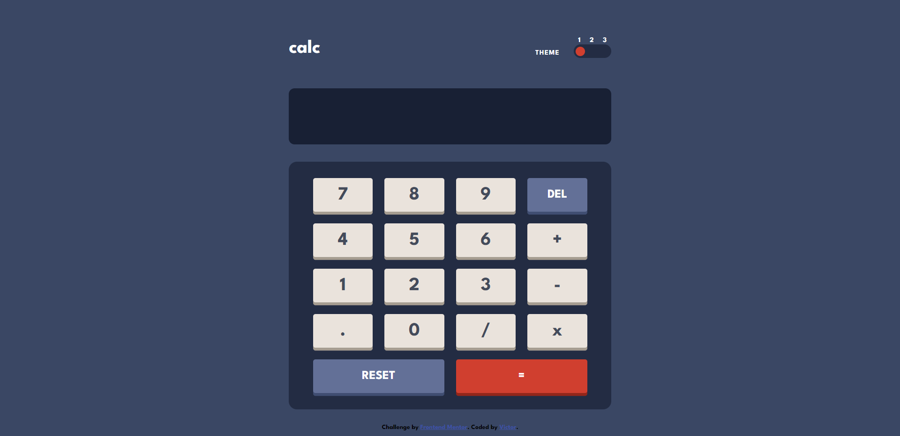

# Frontend Mentor - Calculator app solution

This is a solution to the [Calculator app challenge on Frontend Mentor](https://www.frontendmentor.io/challenges/calculator-app-9lteq5N29). Frontend Mentor challenges help you improve your coding skills by building realistic projects. 

## Table of contents

  - [Overview](#overview)
  - [The challenge](#the-challenge)
  - [Screenshot](#screenshot)
  - [Links](#links)
  - [My process](#my-process)
  - [Built with](#built-with)
  - [What I learned](#what-i-learned)
  - [Continued development](#continued-development)
  - [Useful resources](#useful-resources)
  - [Author](#author)
  - [Acknowledgments](#acknowledgments)

## Overview

### The challenge

Users should be able to:

- See the size of the elements adjust based on their device's screen size
- Perform mathmatical operations like addition, subtraction, multiplication, and division
- Adjust the color theme based on their preference
- **Bonus**: Have their initial theme preference checked using `prefers-color-scheme` and have any additional changes saved in the browser

### Screenshot



### Links

- Solution URL: (https://github.com/victor247k/Calculator-App)
- Live Site URL: (https://victor247k.github.io/Calculator-App/)

## My process

### Built with

- Semantic HTML5 markup
- CSS custom properties
- Flexbox
- CSS Grid
- Mobile-first workflow
- Javascript


### What I learned

I learned about .eval(), forEach() and .slice() in js, I learned about input type range and its the first time I used it and lastly I learned how to style this input type, about variables and the root thing, and I gto better at styiling things.

```html
<input type="range" min="1" max="3" value="1" id="rangeBtn">
```
```css
:root {
  --blue: blue;
  --red: red;
}
body {
  background: var(--blue);
}
```
```js
rangeBtn.addEventListener('input', coolFunction());

text.innerText = eval(text.innerText);

text.innerText = text.innerText.slice(0, -1);
```

### Continued development

I am not stil comfortable with my styling techniques, i stil want to continue improving in this area, I make a lot of mistakes in js, and i want to get better at naming stuff in html, that's all i would like to improve on for now.

### Useful resources

- [Example resource 1](https://www.smashingmagazine.com/2021/12/create-custom-range-input-consistent-browsers/) - This helped me with understanding the input type range button and how to style it. I really like how this source explains this concept, i understood almmost everything mostly from images. Great source.

- [Example resource 2](https://www.cssmatic.com/box-shadow) - This is an amazing website which helped me finally understand the box shadow. I'd recommend it to anyone still learning this concept.

## Author

- Website - No website yet, working on it.
- Frontend Mentor - [@victor247k](https://www.frontendmentor.io/profile/victor247k)
- GitHub - [@victor247k](https://github.com/victor247k)
- Discord - [@victor247#1836]

## Acknowledgments

I am grateful for FrontEnd Mentor for coming up with this chalange, for the indian guy on youtube and his tutorials, and for all of the learning resources on the internet.